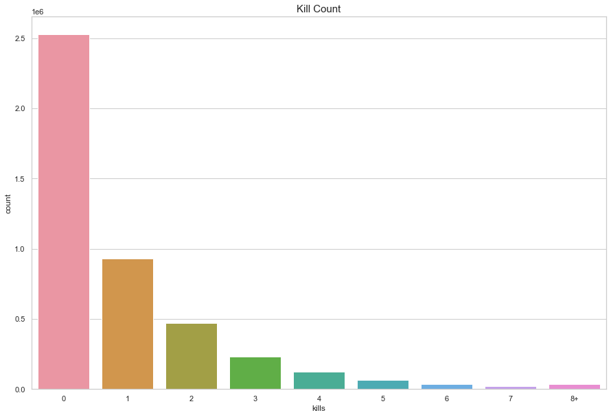
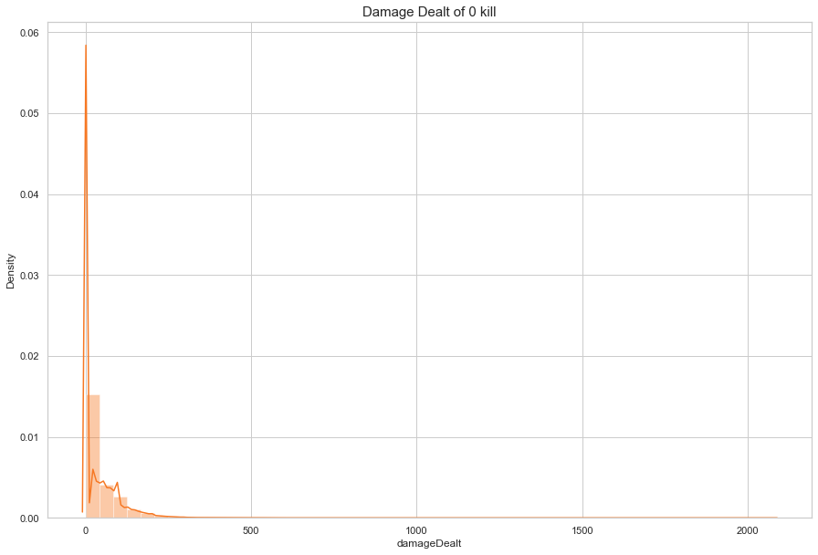
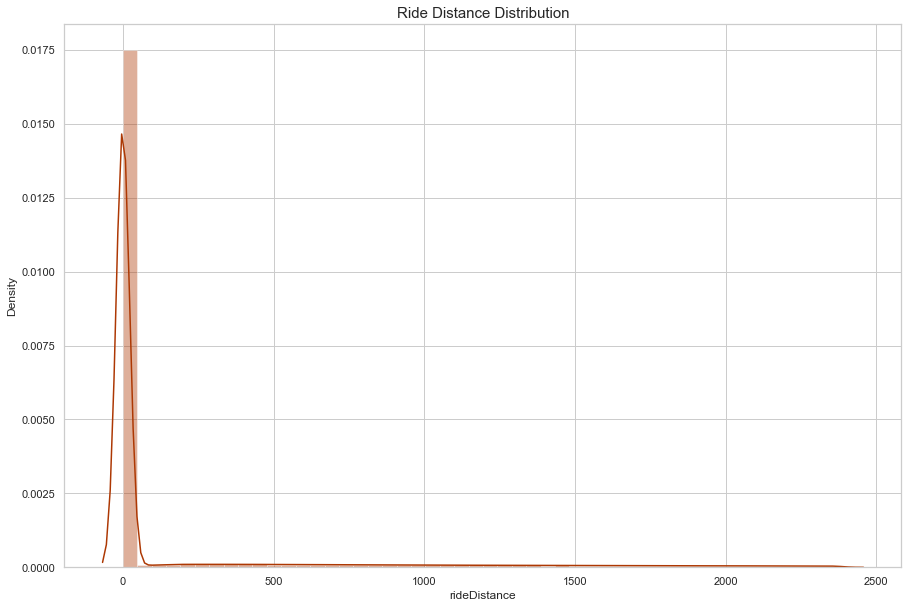
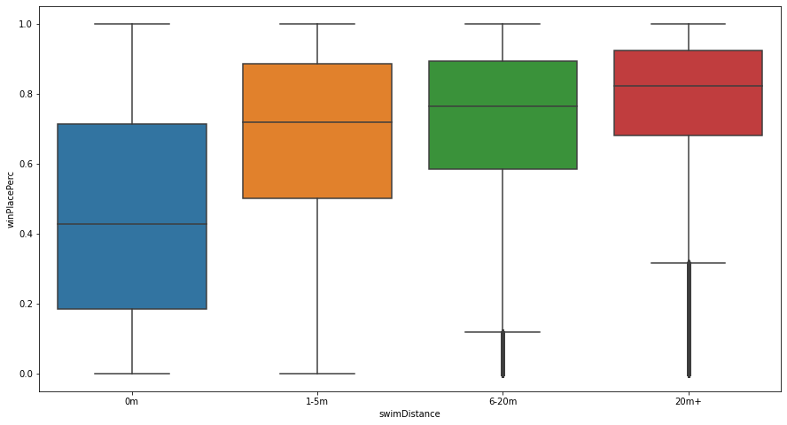
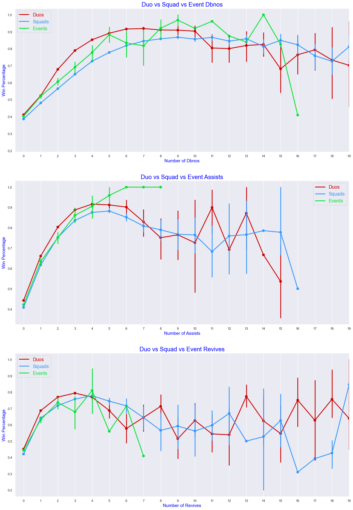
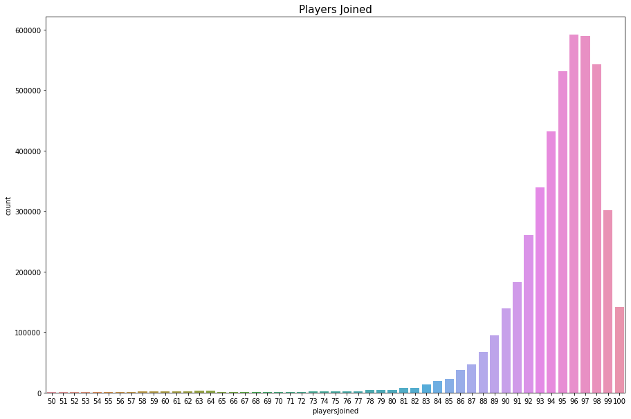

# Mini Project

## 프로젝트 설명

- 머신러닝 워크플로우를 완벽하기 이해하고 사용하기 위한 프로젝트입니다.
- Kaggle의 PUBG 순위 예측 대회 데이터를 사용합니다.

## 데이터 설명

- PUBG 게임에서는 각 매치(matchId)에 최대 100명의 플레이어가 시작합니다.
- 플레이어는 탈락한 다른 팀이 얼마나 생존해 있는지를 기준으로 게임 종료 시 순위(winPlacePerc)가 매겨지는 팀(groupId)에 속할 수 있습니다.
- 게임에서 플레이어는 다양한 무기를 집어들고, 죽지 않은(knocked) 동료들을 되살리고, 차량을 운전하고, 수영하고, 뛰고, 쏘고, 모든 결과를 경험할 수 있습니다.
- 예를 들어 너무 멀리 떨어지거나, 멀리서 달려오다가(자기장 밖에서) 스스로 죽는 것입니다.

- 각 행에 한 플레이어의 post-game 통계를 포함하도록 포맷된 익명화된 PUBG 게임 통계를 다수 제공합니다.
- 데이터는 모든 타입(솔로, 듀오, 스쿼드, 커스텀 등)의 매치에서 가져옵니다.
- 경기당 100명 또는 그룹당 최대 4명의 플레이어가 있다는 보장은 없습니다.

- 1(1위)부터 0(1위)까지의 scaling 된, 최종 통계를 기준으로 선수의 결승 배치를 예측하는 모델을 만들어야 합니다.

## 변수 설명

- **Id** - 플레이어 식별 ID
- **groupId** - 매치 내에서 그룹을 식별하는 정수 ID. 같은 그룹의 플레이어가 다른 경기에서 플레이하는 경우, 매번 다른 그룹 ID를 가집니다.
- **matchId** - 매치를 식별할 정수 ID. 훈련 세트와 테스트 세트 모두 일치하는 항목이 없습니다.
- **assists** - 이 플레이어가 피해를 입힌 적 플레이어 중 동료에게 살해된 플레이어 수.
- **boosts** - 사용된 부스트(에너지 드링크, 진통제 등) 항목 수.
- **damageDealt** - 총 데미지 량. 참고: 자해 제외.
- **DBNOs** - 넉다운 시킨 플레이어 수.
- **headshotKills** - 헤드샷으로 제거한 적 플레이어의 수.
- **heals** - 사용된 치료키트(붕대, 구급상자 등) 항목 수.
- **killPlace** - 죽은 적 플레이어의 수에 따른 매치 내 순위.
- **killPoints** - 킬 기반 플레이어의 외부 순위. (킬만 생각하는 [Elo](https://ko.wikipedia.org/wiki/%EC%97%98%EB%A1%9C_%ED%8F%89%EC%A0%90_%EC%8B%9C%EC%8A%A4%ED%85%9C) 순위라고 생각하시면 됩니다.)
- **kills** - 제거한 적 플레이어의 수.
- **killStreaks** - 짧은 시간 내에 제거한 적 플레이어 수 중 최대치.
- **longestKill** - 처치(kill) 시 제거한 플레이어와 플레이어의 가장 긴 거리. - 플레이어를 쓰러뜨리고 차를 몰고 도망가면 가장 긴 Kill stat가 발생할 수 있기 때문에 오해의 소지가 있을 수 있습니다.
- **maxPlace** - 매치에서 가장 낮은 순위. 데이터가 순위를 건너뛰기 때문에 이 값은 numGroups와 일치하지 않을 수 있습니다.
- **numGroups** - 우리가 가지고 있는 매치 데이터 내 플레이어 그룹 수.
- **revives** - 이 플레이어가 팀원을 부활시킨 횟수.
- **rideDistance** - 미터 단위로 측정한 차량의 총 주행 거리.
- **roadKills** - 로드킬 횟수.
- **swimDistance** - 미터 단위로 측정한 수영으로 이동한 총 거리.
- **teamKills** - 팀킬 횟수.
- **vehicleDestroys** - 파괴된 차량 수.
- **walkDistance** - 미터 단위로 측정한 도보로 이동한 총 거리.
- **weaponsAcquired** - 주운 무기의 수.
- **winPoints** - 승자 기준 외부 순위. (승자만이 중요한 [Elo](https://ko.wikipedia.org/wiki/%EC%97%98%EB%A1%9C_%ED%8F%89%EC%A0%90_%EC%8B%9C%EC%8A%A4%ED%85%9C) 순위라고 생각하시면 됩니다.)
- **winPlacePerc** - 예측 대상(target). 백분위수 승리 배치로, 1은 1위, 0은 경기 꼴찌에 해당합니다. 이 값은 numGroups가 아닌 maxPlace에서 계산되므로, 매체에 누락된 chunks(상당한 양)가 있을 수 있습니다.

# EDA

## 데이터

```python
# 데이터분석 4종 세트
import numpy as np
import pandas as pd
import matplotlib.pyplot as plt
import seaborn as sns
pd.set_option('display.max_columns', 100)
# pd.set_option('display.max_rows', 200)
# pd.set_option('display.width', 1000)
import warnings
warnings.filterwarnings("ignore")
```

```python
viridis = sns.color_palette("viridis_r")
oranges = sns.color_palette("Oranges")
blues = sns.color_palette("Blues")
pastel1 = sns.color_palette("Pastel1")
set2 = sns.color_palette("Set2")
set3 = sns.color_palette("Set3")
display(viridis)
display(oranges)
display(blues)
display(pastel1)
display(set2)
display(set3)
```

<svg  width="330" height="55"><rect x="0" y="0" width="55" height="55" style="fill:#a0da39;stroke-width:2;stroke:rgb(255,255,255)"/><rect x="55" y="0" width="55" height="55" style="fill:#4ac16d;stroke-width:2;stroke:rgb(255,255,255)"/><rect x="110" y="0" width="55" height="55" style="fill:#1fa187;stroke-width:2;stroke:rgb(255,255,255)"/><rect x="165" y="0" width="55" height="55" style="fill:#277f8e;stroke-width:2;stroke:rgb(255,255,255)"/><rect x="220" y="0" width="55" height="55" style="fill:#365c8d;stroke-width:2;stroke:rgb(255,255,255)"/><rect x="275" y="0" width="55" height="55" style="fill:#46327e;stroke-width:2;stroke:rgb(255,255,255)"/></svg>

<svg  width="330" height="55"><rect x="0" y="0" width="55" height="55" style="fill:#fee3c8;stroke-width:2;stroke:rgb(255,255,255)"/><rect x="55" y="0" width="55" height="55" style="fill:#fdc692;stroke-width:2;stroke:rgb(255,255,255)"/><rect x="110" y="0" width="55" height="55" style="fill:#fda057;stroke-width:2;stroke:rgb(255,255,255)"/><rect x="165" y="0" width="55" height="55" style="fill:#f67824;stroke-width:2;stroke:rgb(255,255,255)"/><rect x="220" y="0" width="55" height="55" style="fill:#e05206;stroke-width:2;stroke:rgb(255,255,255)"/><rect x="275" y="0" width="55" height="55" style="fill:#ad3803;stroke-width:2;stroke:rgb(255,255,255)"/></svg>

<svg  width="330" height="55"><rect x="0" y="0" width="55" height="55" style="fill:#dbe9f6;stroke-width:2;stroke:rgb(255,255,255)"/><rect x="55" y="0" width="55" height="55" style="fill:#bad6eb;stroke-width:2;stroke:rgb(255,255,255)"/><rect x="110" y="0" width="55" height="55" style="fill:#89bedc;stroke-width:2;stroke:rgb(255,255,255)"/><rect x="165" y="0" width="55" height="55" style="fill:#539ecd;stroke-width:2;stroke:rgb(255,255,255)"/><rect x="220" y="0" width="55" height="55" style="fill:#2b7bba;stroke-width:2;stroke:rgb(255,255,255)"/><rect x="275" y="0" width="55" height="55" style="fill:#0b559f;stroke-width:2;stroke:rgb(255,255,255)"/></svg>

<svg  width="495" height="55"><rect x="0" y="0" width="55" height="55" style="fill:#fbb4ae;stroke-width:2;stroke:rgb(255,255,255)"/><rect x="55" y="0" width="55" height="55" style="fill:#b3cde3;stroke-width:2;stroke:rgb(255,255,255)"/><rect x="110" y="0" width="55" height="55" style="fill:#ccebc5;stroke-width:2;stroke:rgb(255,255,255)"/><rect x="165" y="0" width="55" height="55" style="fill:#decbe4;stroke-width:2;stroke:rgb(255,255,255)"/><rect x="220" y="0" width="55" height="55" style="fill:#fed9a6;stroke-width:2;stroke:rgb(255,255,255)"/><rect x="275" y="0" width="55" height="55" style="fill:#ffffcc;stroke-width:2;stroke:rgb(255,255,255)"/><rect x="330" y="0" width="55" height="55" style="fill:#e5d8bd;stroke-width:2;stroke:rgb(255,255,255)"/><rect x="385" y="0" width="55" height="55" style="fill:#fddaec;stroke-width:2;stroke:rgb(255,255,255)"/><rect x="440" y="0" width="55" height="55" style="fill:#f2f2f2;stroke-width:2;stroke:rgb(255,255,255)"/></svg>

<svg  width="440" height="55"><rect x="0" y="0" width="55" height="55" style="fill:#66c2a5;stroke-width:2;stroke:rgb(255,255,255)"/><rect x="55" y="0" width="55" height="55" style="fill:#fc8d62;stroke-width:2;stroke:rgb(255,255,255)"/><rect x="110" y="0" width="55" height="55" style="fill:#8da0cb;stroke-width:2;stroke:rgb(255,255,255)"/><rect x="165" y="0" width="55" height="55" style="fill:#e78ac3;stroke-width:2;stroke:rgb(255,255,255)"/><rect x="220" y="0" width="55" height="55" style="fill:#a6d854;stroke-width:2;stroke:rgb(255,255,255)"/><rect x="275" y="0" width="55" height="55" style="fill:#ffd92f;stroke-width:2;stroke:rgb(255,255,255)"/><rect x="330" y="0" width="55" height="55" style="fill:#e5c494;stroke-width:2;stroke:rgb(255,255,255)"/><rect x="385" y="0" width="55" height="55" style="fill:#b3b3b3;stroke-width:2;stroke:rgb(255,255,255)"/></svg>

<svg  width="660" height="55"><rect x="0" y="0" width="55" height="55" style="fill:#8dd3c7;stroke-width:2;stroke:rgb(255,255,255)"/><rect x="55" y="0" width="55" height="55" style="fill:#ffffb3;stroke-width:2;stroke:rgb(255,255,255)"/><rect x="110" y="0" width="55" height="55" style="fill:#bebada;stroke-width:2;stroke:rgb(255,255,255)"/><rect x="165" y="0" width="55" height="55" style="fill:#fb8072;stroke-width:2;stroke:rgb(255,255,255)"/><rect x="220" y="0" width="55" height="55" style="fill:#80b1d3;stroke-width:2;stroke:rgb(255,255,255)"/><rect x="275" y="0" width="55" height="55" style="fill:#fdb462;stroke-width:2;stroke:rgb(255,255,255)"/><rect x="330" y="0" width="55" height="55" style="fill:#b3de69;stroke-width:2;stroke:rgb(255,255,255)"/><rect x="385" y="0" width="55" height="55" style="fill:#fccde5;stroke-width:2;stroke:rgb(255,255,255)"/><rect x="440" y="0" width="55" height="55" style="fill:#d9d9d9;stroke-width:2;stroke:rgb(255,255,255)"/><rect x="495" y="0" width="55" height="55" style="fill:#bc80bd;stroke-width:2;stroke:rgb(255,255,255)"/><rect x="550" y="0" width="55" height="55" style="fill:#ccebc5;stroke-width:2;stroke:rgb(255,255,255)"/><rect x="605" y="0" width="55" height="55" style="fill:#ffed6f;stroke-width:2;stroke:rgb(255,255,255)"/></svg>

```python
dtypes = {
        'assists'           : 'uint8',
        'boosts'            : 'uint8',
        'damageDealt'       : 'float16',
        'DBNOs'             : 'uint8',
        'headshotKills'     : 'uint8',
        'heals'             : 'uint8',
        'killPlace'         : 'uint8',
        'killPoints'        : 'uint16',
        'kills'             : 'uint8',
        'killStreaks'       : 'uint8',
        'longestKill'       : 'float16',
        'matchDuration'     : 'uint8',
        'maxPlace'          : 'uint8',
        'numGroups'         : 'uint8',
        'rankPoints'        : 'uint8',
        'revives'           : 'uint8',
        'rideDistance'      : 'float16',
        'roadKills'         : 'uint8',
        'swimDistance'      : 'float16',
        'teamKills'         : 'uint8',
        'vehicleDestroys'   : 'uint8',
        'walkDistance'      : 'float16',
        'weaponsAcquired'   : 'uint8',
        'winPoints'         : 'uint8',
        'winPlacePerc'      : 'float16'
}
train = pd.read_csv('../data/train_V2.csv', dtype=dtypes)
train.info()
```

    <class 'pandas.core.frame.DataFrame'>
    RangeIndex: 4446966 entries, 0 to 4446965
    Data columns (total 29 columns):
     #   Column           Dtype
    ---  ------           -----
     0   Id               object
     1   groupId          object
     2   matchId          object
     3   assists          uint8
     4   boosts           uint8
     5   damageDealt      float16
     6   DBNOs            uint8
     7   headshotKills    uint8
     8   heals            uint8
     9   killPlace        uint8
     10  killPoints       uint16
     11  kills            uint8
     12  killStreaks      uint8
     13  longestKill      float16
     14  matchDuration    uint8
     15  matchType        object
     16  maxPlace         uint8
     17  numGroups        uint8
     18  rankPoints       uint8
     19  revives          uint8
     20  rideDistance     float16
     21  roadKills        uint8
     22  swimDistance     float16
     23  teamKills        uint8
     24  vehicleDestroys  uint8
     25  walkDistance     float16
     26  weaponsAcquired  uint8
     27  winPoints        uint8
     28  winPlacePerc     float16
    dtypes: float16(6), object(4), uint16(1), uint8(18)
    memory usage: 271.4+ MB

```python
train.head()
```

<div>
<style scoped>
    .dataframe tbody tr th:only-of-type {
        vertical-align: middle;
    }

    .dataframe tbody tr th {
        vertical-align: top;
    }

    .dataframe thead th {
        text-align: right;
    }

</style>
<table border="1" class="dataframe">
  <thead>
    <tr style="text-align: right;">
      <th></th>
      <th>Id</th>
      <th>groupId</th>
      <th>matchId</th>
      <th>assists</th>
      <th>boosts</th>
      <th>damageDealt</th>
      <th>DBNOs</th>
      <th>headshotKills</th>
      <th>heals</th>
      <th>killPlace</th>
      <th>...</th>
      <th>revives</th>
      <th>rideDistance</th>
      <th>roadKills</th>
      <th>swimDistance</th>
      <th>teamKills</th>
      <th>vehicleDestroys</th>
      <th>walkDistance</th>
      <th>weaponsAcquired</th>
      <th>winPoints</th>
      <th>winPlacePerc</th>
    </tr>
  </thead>
  <tbody>
    <tr>
      <th>0</th>
      <td>7f96b2f878858a</td>
      <td>4d4b580de459be</td>
      <td>a10357fd1a4a91</td>
      <td>0</td>
      <td>0</td>
      <td>0.00</td>
      <td>0</td>
      <td>0</td>
      <td>0</td>
      <td>60</td>
      <td>...</td>
      <td>0</td>
      <td>0.0000</td>
      <td>0</td>
      <td>0.00</td>
      <td>0</td>
      <td>0</td>
      <td>244.80</td>
      <td>1</td>
      <td>1466</td>
      <td>0.4444</td>
    </tr>
    <tr>
      <th>1</th>
      <td>eef90569b9d03c</td>
      <td>684d5656442f9e</td>
      <td>aeb375fc57110c</td>
      <td>0</td>
      <td>0</td>
      <td>91.47</td>
      <td>0</td>
      <td>0</td>
      <td>0</td>
      <td>57</td>
      <td>...</td>
      <td>0</td>
      <td>0.0045</td>
      <td>0</td>
      <td>11.04</td>
      <td>0</td>
      <td>0</td>
      <td>1434.00</td>
      <td>5</td>
      <td>0</td>
      <td>0.6400</td>
    </tr>
    <tr>
      <th>2</th>
      <td>1eaf90ac73de72</td>
      <td>6a4a42c3245a74</td>
      <td>110163d8bb94ae</td>
      <td>1</td>
      <td>0</td>
      <td>68.00</td>
      <td>0</td>
      <td>0</td>
      <td>0</td>
      <td>47</td>
      <td>...</td>
      <td>0</td>
      <td>0.0000</td>
      <td>0</td>
      <td>0.00</td>
      <td>0</td>
      <td>0</td>
      <td>161.80</td>
      <td>2</td>
      <td>0</td>
      <td>0.7755</td>
    </tr>
    <tr>
      <th>3</th>
      <td>4616d365dd2853</td>
      <td>a930a9c79cd721</td>
      <td>f1f1f4ef412d7e</td>
      <td>0</td>
      <td>0</td>
      <td>32.90</td>
      <td>0</td>
      <td>0</td>
      <td>0</td>
      <td>75</td>
      <td>...</td>
      <td>0</td>
      <td>0.0000</td>
      <td>0</td>
      <td>0.00</td>
      <td>0</td>
      <td>0</td>
      <td>202.70</td>
      <td>3</td>
      <td>0</td>
      <td>0.1667</td>
    </tr>
    <tr>
      <th>4</th>
      <td>315c96c26c9aac</td>
      <td>de04010b3458dd</td>
      <td>6dc8ff871e21e6</td>
      <td>0</td>
      <td>0</td>
      <td>100.00</td>
      <td>0</td>
      <td>0</td>
      <td>0</td>
      <td>45</td>
      <td>...</td>
      <td>0</td>
      <td>0.0000</td>
      <td>0</td>
      <td>0.00</td>
      <td>0</td>
      <td>0</td>
      <td>49.75</td>
      <td>2</td>
      <td>0</td>
      <td>0.1875</td>
    </tr>
  </tbody>
</table>
<p>5 rows × 29 columns</p>
</div>

- Id, groupId, matchId 는 비공개 데이터
- 드랍해도 상관없을 것 같습니다

## Kill

```python
sns.set_theme(style="whitegrid", palette="Oranges")
```

```python
print(f"평균 킬 : {train['kills'].mean()}")
print(f"상위 1퍼 : {train['kills'].quantile(0.99)}")
print(f"MAX 킬 : {train['kills'].max()}")
```

    평균 킬 : 0.9247833241810259
    상위 1퍼 : 7.0
    MAX 킬 : 72

```python
data = train.copy()
data.loc[data['kills']>data['kills'].quantile(0.99)] = '8+'

plt.figure(figsize=(15,10))
sns.countplot(data['kills'].astype(str).sort_values())
plt.title('Kill Count', fontsize=15)
plt.show()
```



```python
data = train.copy()
data = data[data['kills']==0]

plt.figure(figsize=(15,10))
sns.distplot(data['damageDealt'], color=oranges[3])
plt.title('Damage Dealt of 0 kill', fontsize=15)
plt.show()
```



```python
print(f"{len(data[data['winPlacePerc']==1])}\t명의 플레이어가\t({100*len(data[data['winPlacePerc']==1])/len(train):.4f}%) 킬 없이 우승")

data1 = train[train['damageDealt'] == 0].copy()
print(f"{len(data1[data1['winPlacePerc']==1])}\t명의 플레이어가  \t({100*len(data1[data1['winPlacePerc']==1])/len(train):.4f}%) 데미지 없이 우승")
```

    16666	명의 플레이어가	(0.3748%) 킬 없이 우승
    4770	명의 플레이어가  	(0.1073%) 데미지 없이 우승

```python
sns.jointplot(x="winPlacePerc", y="kills", data=train, height=10, ratio=3, color=oranges[3])
plt.show()
```


- **`kills`**는 **`winPlacePerc`**사이에는 좀 높은 상관관계가 있습니다.
- (0킬, 1-3킬, 4-6킬, 7-9킬, 10+킬)을 기준으로 그룹화합니다.

```python
kills = train.copy()

kills['killsCategories'] = pd.cut(kills['kills'], [-1, 0, 2, 5, 10, 72], labels=['0_kills','1-3_kills', '4-6_kills', '7-9_kills', '10+_kills'])

plt.figure(figsize=(15,8))
sns.boxplot(x="killsCategories", y="winPlacePerc", data=kills)
plt.show()
```


## Walk

```python
sns.set_theme(style="whitegrid", palette="viridis_r")
```

```python
print(f"평균 도보 거리 : {train['walkDistance'].mean():.1f}m")
print(f"상위 1% : {train['walkDistance'].quantile(0.99):.1f}m")
print(f"MAX 도보 거리 : {train['walkDistance'].max():.1f}m")
```

    평균 도보 거리 : 1154.2m
    상위 1% : 4396.0m
    MAX 도보 거리 : 25780.0m

```python
data = train.copy()
data = data[data['walkDistance'] < train['walkDistance'].quantile(0.99)]
plt.figure(figsize=(15,10))
plt.title("Walking Distance Distribution",fontsize=15)
sns.distplot(data['walkDistance'], color=viridis[2])
plt.show()
```


```python
print(f"{len(data[data['walkDistance'] == 0])}명의 플레이어가 ({100*len(data1[data1['walkDistance']==0])/len(train):.4f}%) 0미터를 걸었습니다.")
```

    99603명의 플레이어가 (2.0329%) 0미터를 걸었습니다.

- 이것은 한 발자국도 내딛지 못하고 죽거나 혹은 그들이 뒷걸음질 친다는 것을 의미합니다.

```python
sns.jointplot(x="winPlacePerc", y="walkDistance",  data=train, height=10, ratio=3, color=viridis[2])
plt.show()
```


- `winPlacePerc`와 `walkDistance` 사이에는 좀 높은 상관관계가 있습니다.

## Ride

```python
sns.set_theme(style="whitegrid", palette="Oranges")
```

```python
print(f"평균 주행거리 : {train['rideDistance'].mean():.1f}m")
print(f"상위 1퍼 : {train['rideDistance'].quantile(0.99):.1f}m")
print(f"MAX 주행거리 : {train['rideDistance'].max():.1f}m")
```

    평균 주행거리 : 606.1m
    상위 1퍼 : 6966.0m
    MAX 주행거리 : 40710.0m

```python
data = train.copy()
data = data[data['rideDistance'] < train['rideDistance'].quantile(0.9)]
plt.figure(figsize=(15,10))
plt.title("Ride Distance Distribution",fontsize=15)
sns.distplot(data['rideDistance'], color=oranges[5])
plt.show()
```



```python
print(f"{len(data[data['rideDistance'] == 0])}명의 플레이어는 ({100*len(data1[data1['rideDistance']==0])/len(train):.4f}%) 0미터를 주행했습니다.")
```

    3309429명의 플레이어는 (23.1022%) 0미터를 주행했습니다.

- 이것은 차량을 탑승하지 않았다는 말입니다.

```python
# sns.jointplot(x="winPlacePerc", y="rideDistance", data=train, height=10, ratio=3, color=oranges[5])
# plt.show()
```

```python
plt.figure(figsize=(15, 10))
sns.scatterplot(x="winPlacePerc", y="rideDistance", data=train, color=oranges[5], alpha=0.3)
plt.show()
```


- `winPlacePerc`와 `rideDistance` 사이에는 약간 상관관계가 있습니다.

## Destroy a vehicle

- 차량을 파괴하는 것은 플레이어가 기술을 가지고 있다는 것을 보여줍니다.

```python
f,ax1 = plt.subplots(figsize =(20,10))
sns.pointplot(x='vehicleDestroys',y='winPlacePerc',data=data,color='#606060',alpha=0.8)
plt.xlabel('Number of Vehicle Destroys',fontsize = 15,color='blue')
plt.ylabel('Win Percentage',fontsize = 15,color='blue')
plt.title('Vehicle Destroys/ Win Ratio',fontsize = 20,color='blue')
plt.grid()
plt.show()
```


- 차량 한 대를 파괴하면 승산이 높아집니다.

## Swim

```python
sns.set_theme(style="whitegrid", palette="Blues")
```

```python
print(f"평균 수영거리 : {train['swimDistance'].mean():.1f}m")
print(f"상위 1퍼 : {train['swimDistance'].quantile(0.99):.1f}m")
print(f"MAX 수영거리 : {train['swimDistance'].max():.1f}m")
```

    평균 수영거리 : 4.5m
    상위 1퍼 : 123.0m
    MAX 수영거리 : 3823.0m

```python
data = train.copy()
data = data[data['swimDistance'] < train['swimDistance'].quantile(0.95)]
plt.figure(figsize=(15,10))
plt.title("Swim Distance Distribution",fontsize=15)
sns.distplot(data['swimDistance'], color=blues[4])
plt.show()
```


- 거의 아무도 수영하지 않습니다.
- 수영 거리를 4개 그룹으로 나누어 winPlacePerc과 관계 plot을 그려보겠습니다.

```python
swim = train.copy()

swim['swimDistance'] = pd.cut(swim['swimDistance'], [-1, 0, 5, 20, 5286], labels=['0m','1-5m', '6-20m', '20m+'])

plt.figure(figsize=(15,8))
sns.boxplot(x="swimDistance", y="winPlacePerc", data=swim)
plt.show()
```



- 수영을 하면 정상에 오르는 것 같습니다. 하지만
- **PUBG에 몇개의 맵은 물이 거의 없습니다.**

## Heal

```python
print(f"평균 힐링 횟수 : {train['heals'].mean():.1f}번")
print(f"상위 1퍼 : {train['heals'].quantile(0.99)}번")
print(f"MAX 힐링 횟수 : {train['heals'].max()}번")
```

    평균 힐링 횟수 : 1.4번
    상위 1퍼 : 12.0번
    MAX 힐링 횟수 : 80번

```python
print(f"평균 부시팅 횟수 : {train['boosts'].mean():.1f}번")
print(f"상위 1퍼 : {train['boosts'].quantile(0.99):.1f}번")
print(f"MAX 도핑 횟수 : {train['boosts'].max()}번")
```

    평균 부시팅 횟수 : 1.1번
    상위 1퍼 : 7.0번
    MAX 도핑 횟수 : 33번

```python
data = train.copy()
data = data[data['heals'] < data['heals'].quantile(0.99)]
data = data[data['boosts'] < data['boosts'].quantile(0.99)]

f,ax1 = plt.subplots(figsize =(20,10))
sns.pointplot(x='heals', y='winPlacePerc', data=data, color=set3[3])
sns.pointplot(x='boosts', y='winPlacePerc', data=data, color=set3[2])
plt.text(4,0.6,'Heals', color=set3[3], fontsize = 17, style = 'italic')
plt.text(4,0.55,'Boosts', color=set3[2], fontsize = 17, style = 'italic')
plt.xlabel('Number of heal/boost items',fontsize = 15,color=oranges[-2])
plt.ylabel('Win Percentage',fontsize = 15,color=oranges[-2])
plt.title('Heals vs Boosts',fontsize = 20,color=oranges[-2])
plt.grid()
plt.show()
```


```python
sns.jointplot(x="winPlacePerc", y="heals", data=train, height=10, ratio=3, color=set3[3])
plt.show()
```


```python
sns.jointplot(x="winPlacePerc", y="boosts", data=train, height=10, ratio=3, color=set3[2])
plt.show()
```


- 힐링과 부스팅은 확실히 winPlacePerc와 관련이 있습니다.
- 부스팅은 그 이상입니다.

- 모든 그래프에서 값이 0일 때 이상치가 발생합니다.

## Solos, Duos and Squads

- 게임에는 세 가지 게임 모드가 있습니다. 솔로(1명), 듀오(1-2명), 스쿼드(1-4명)
- 최대 100명의 플레이어가 같은 서버에 들어오기 때문에 듀오의 경우 최대 50팀, 스쿼드의 경우 최대 25팀입니다.

```python
plt.figure(figsize=(15,10))
sns.countplot(x='matchType', data=train, order = train['matchType'].value_counts().index)
plt.xticks(rotation=60, fontsize=14)
plt.title("Match types", fontsize=17)
plt.show()
```


- flaretpp와 crashtpp는 이벤트 모드에 있어야하며, 보통 솔로와 유사합니다.

**flare(플레어 건)**

- 플레어 건을 얻을 수 있습니다.
- 플레어 건은 하늘을 향해 발사되는 일종의 신호입니다.
- 해당 위치에 플레어 건이 사용될 때 비행기가 보급 상자(Care Package)를 공급하는 특수 화기입니다.

**crash(크래쉬 캐니지)**

- Road scary는 연료와 불이 왕인 이벤트 모드입니다.
- 크래쉬 캐니지에는 화기가 없고, 근접 무기와 드론이 있습니다.
- 당신의 듀오를 결승전에 진출시킬 수 있는 운전 스킬에 집중해야 합니다.
- 그리고 자기장은 빠르게 줄어듭니다. 그래서 모든 과정이 빠르게 이루어져야 합니다.

```python
train.loc[:, "team"] = 0 # solo, duo, squad가 아닌 나머지는 0(이벤트 모드)
train.loc[train['matchType'].isin(["solo-fpp","solo","normal-solo-fpp","normal-solo"]), 'team']= 1
train.loc[train['matchType'].isin(["duo-fpp","duo","normal-duo-fpp","normal-duo"]), 'team'] = 2
train.loc[train['matchType'].isin(["squad-fpp","squad","normal-squad-fpp","normal-squad"]), 'team'] = 3
```

```python
solos = train.loc[train['matchType'].isin(["solo-fpp","solo","normal-solo-fpp","normal-solo"])]
duos = train[train['team']==2]
squads = train[train['team']==3]
events = train[train['team']==0]
print(f"{len(solos)}\t({100*len(solos)/len(train):.2f}%)\tsolo games")
print(f"{len(duos)}\t({100*len(duos)/len(train):.2f}%)\tduo games")
print(f"{len(squads)}\t({100*len(squads)/len(train):.2f}%)\tsquad games")
print(f"{len(events)}\t({100*len(events)/len(train):.2f}%)\t\tevent games")
```

    720713	(16.21%)	solo games
    1315970	(29.59%)	duo games
    2400402	(53.98%)	squad games
    9881	(0.22%)		event games

```python
f,ax1 = plt.subplots(figsize =(20,10))
sns.pointplot(x='kills',y='winPlacePerc',data=solos,color='black',alpha=0.8)
sns.pointplot(x='kills',y='winPlacePerc',data=duos,color='#CC0000',alpha=0.8)
sns.pointplot(x='kills',y='winPlacePerc',data=squads,color='#3399FF',alpha=0.8)
sns.pointplot(x='kills',y='winPlacePerc',data=events,color='#00E536',alpha=0.8)
plt.legend(labels=['Solos', 'Duos', 'Squads', 'Events'], labelcolor=['black', '#CC0000', '#3399FF', '#00E536'], fontsize=16, loc='best')
leg = ax1.get_legend()
leg.legendHandles[0].set_color('black')
leg.legendHandles[1].set_color('#CC0000')
leg.legendHandles[2].set_color('#3399FF')
leg.legendHandles[3].set_color('#00E536')
plt.xlabel('Number of kills',fontsize = 15,color='blue')
plt.ylabel('Win Percentage',fontsize = 15,color='blue')
plt.xticks(range(40), range(40))
plt.title('Solo vs Duo vs Squad vs Event Kills',fontsize = 20,color='blue')
plt.grid()
plt.show()
```


- 모든 매치의 종류 게임에서 `winPlacePerc`와 비슷한 상관관계를 가지고 있습니다.

## DBNO / Assist / Revive

- `DBNOs` 속성은 적 플레이어가 넉다운을 했다는 의미입니다.
- "Knock"는 듀오, 스쿼드, 이벤트에서만 일어날 수 있는데, 이는 팀원들이 주어진 시간 내에 넉다운당한 플레이어를 "부활"시킬 수 있기 때문입니다.
- `assists`는 듀오, 스쿼드, 이벤트에서만 발생할 수 있습니다. 그것은 일반적으로 그 플레이어가 킬에 관여했다는 것을 의미합니다.
- `revives`도 듀오, 스쿼드, 이벤트에서만 발생합니다.

```python
def plot_ax(col, ax):
    sns.pointplot(x=col,y='winPlacePerc',data=duos,color='#CC0000',alpha=0.8, ax=ax)
    sns.pointplot(x=col,y='winPlacePerc',data=squads,color='#3399FF',alpha=0.8, ax=ax)
    sns.pointplot(x=col,y='winPlacePerc',data=events,color='#00E536',alpha=0.8, ax=ax)
    ax.set_title(f'Duo vs Squad vs Event {col.title()}',fontsize = 20,color='blue')
    ax.set_xlabel(f"Number of {col.title()}",fontsize = 15,color='blue')
    ax.set_ylabel('Win Percentage',fontsize = 15,color='blue')
    ax.set_xticks(range(20),range(20))
    ax.grid()
    ax.legend(labels=['Duos', 'Squads', 'Events'], labelcolor=['#CC0000', '#3399FF', '#00E536'], fontsize=16, loc='best')
    leg = ax.get_legend()
    leg.legendHandles[0].set_color('#CC0000')
    leg.legendHandles[1].set_color('#3399FF')
    leg.legendHandles[2].set_color('#00E536')

f,ax = plt.subplots(nrows=3, ncols=1, figsize =(20,30))

for i, p in enumerate(['DBNOs', 'assists', 'revives']):
    plot_ax(p, ax[i])

plt.show()
```



- DBNO, Assist, Revive가 많다고 우승할 확률이 높은 것은 아닌것 같습니다.
- `winPlacePerc`와 약간의 상관관계를 가지고 있는 것을 알 수 있습니다.

## Correlation

```python
f,ax = plt.subplots(figsize=(15, 15))
sns.heatmap(train.corr(), annot=True, linewidths=.5, fmt= '.1f',ax=ax)
plt.show()
```


- target(winPlacePerc)의 경우 중간에서 높은 상관관계가 있는 column이 몇 가지 있습니다.
- 가장 높은 양의 상관관계는 walkDistance이고 가장 높은 음의 상관관계는 killPlace입니다.

### Positive correlation variables with target

```python
cols = train.corr().nlargest(k, 'winPlacePerc')['winPlacePerc'].index
```

```python
k = 5 #number of variables for heatmap
f,ax = plt.subplots(figsize=(11, 11))
cols = train.corr().nlargest(k, 'winPlacePerc')['winPlacePerc'].index
sns.set(font_scale=1.25)
hm = sns.heatmap(data=train[cols].corr(), cbar=True, annot=True, square=True, fmt='.2f', annot_kws={'size': 10})
plt.show()
```


- 위의 column과 killPlace를 같이 표시합니다.

```python
sns.set()
cols = ['winPlacePerc', 'walkDistance', 'boosts', 'weaponsAcquired', 'damageDealt', 'killPlace']
sns.pairplot(train[cols], size = 2.5)
plt.show()
```


# Feature Engineering

- PUBG의 한 게임은 최대 100명의 플레이어가 서로 싸울 수 있습니다.
- 하지만 대부분의 게임은 "Full"이 아닙니다. 들어온 플레이어 수를 알려주는 변수는 없습니다.
- 플레이어가 참가한 게임에 몇명이 게임에 참여했는지 만들어보겠습니다.

```python
train['playersJoined'] = train.groupby('matchId')['matchId'].transform('count')
```

```python
data = train.copy()
data = data[data['playersJoined']>49]
plt.figure(figsize=(15,10))
sns.countplot(data['playersJoined'])
plt.title("Players Joined",fontsize=15)
plt.show()
```



- 참여한 플레이어 수를 가지고 kills와 damageDealt 등 column에 가중치를 부여할 수 있습니다.
- 실제로 게임 내에 100명이 있을 때와 90명이 있을 때 100명이 있을 때가 적을 더 죽이기 쉬울 것입니다.
- 다시 계산을 해본다면 게임에 100명이 참가했을 때 1킬 점수는 1점(그대로)이고 90명이 참가했을 때는 1킬 점수는 (100-90)/100 + 1 = 1.1점입니다.
- 혹은 다르게 가중치를 부여하는 방법도 있을 것입니다.

```python
train['killsNorm'] = train['kills']*((100-train['playersJoined'])/100 + 1)
train['damageDealtNorm'] = train['damageDealt']*((100-train['playersJoined'])/100 + 1)
train[['playersJoined', 'kills', 'killsNorm', 'damageDealt', 'damageDealtNorm']][5:8]
```

<div>
<style scoped>
    .dataframe tbody tr th:only-of-type {
        vertical-align: middle;
    }

    .dataframe tbody tr th {
        vertical-align: top;
    }

    .dataframe thead th {
        text-align: right;
    }

</style>
<table border="1" class="dataframe">
  <thead>
    <tr style="text-align: right;">
      <th></th>
      <th>playersJoined</th>
      <th>kills</th>
      <th>killsNorm</th>
      <th>damageDealt</th>
      <th>damageDealtNorm</th>
    </tr>
  </thead>
  <tbody>
    <tr>
      <th>5</th>
      <td>95</td>
      <td>1</td>
      <td>1.05</td>
      <td>100.000000</td>
      <td>105.000000</td>
    </tr>
    <tr>
      <th>6</th>
      <td>97</td>
      <td>0</td>
      <td>0.00</td>
      <td>0.000000</td>
      <td>0.000000</td>
    </tr>
    <tr>
      <th>7</th>
      <td>96</td>
      <td>0</td>
      <td>0.00</td>
      <td>8.539062</td>
      <td>8.880625</td>
    </tr>
  </tbody>
</table>
</div>

- 또 다른 간단한 특징은 힐링과 부스트의 합계 그리고 주행 총 거리입니다.

```python
train['healsAndBoosts'] = train['heals']+train['boosts']
train['totalDistance'] = train['walkDistance']+train['rideDistance']+train['swimDistance']
```

- 부스팅 아이템을 사용하면 더 빨리 달리게 됩니다.
- 또한 자기장(PUBG 용어)밖에 있으면 더 많이 파밍을 할 수 있습니다(대신 더 많이 움직여야한다는 의미).
- 그래서 `boostsPerWalkDistance` 특징(feature)를 만들어 보겠습니다.
- 힐링은 더 빨리 뛰게 하지는 않지만, 자기장밖에서 버틸 수 있게 해주고, 그 덕에 더 많이 파밍을 할 수 있습니다.
- 이제 힐링에도 `healsAndBoostsPerWalkDistance` 기능(feature)을 만들어 보겠습니다.

```python
train['boostsPerWalkDistance'] = train['boosts']/(train['walkDistance']+1) # 무한대를 피하기위해 +1을 합니다, 왜냐하면 walkDistance=0 인데 boosts>0 인 값이 존재합니다.
train['boostsPerWalkDistance'].fillna(0, inplace=True)
train['healsPerWalkDistance'] = train['heals']/(train['walkDistance']+1) # 무한대를 피하기위해 +1을 합니다, 왜냐하면 walkDistance=0 인데 heals>0 인 값이 존재합니다.
train['healsPerWalkDistance'].fillna(0, inplace=True)
train['healsAndBoostsPerWalkDistance'] = train['healsAndBoosts']/(train['walkDistance']+1) # 무한대를 피하기위해 +1을 합니다.
train['healsAndBoostsPerWalkDistance'].fillna(0, inplace=True)
train[['walkDistance', 'boosts', 'boostsPerWalkDistance' ,'heals',  'healsPerWalkDistance', 'healsAndBoosts', 'healsAndBoostsPerWalkDistance']][40:45]
```

<div>
<style scoped>
    .dataframe tbody tr th:only-of-type {
        vertical-align: middle;
    }

    .dataframe tbody tr th {
        vertical-align: top;
    }

    .dataframe thead th {
        text-align: right;
    }

</style>
<table border="1" class="dataframe">
  <thead>
    <tr style="text-align: right;">
      <th></th>
      <th>walkDistance</th>
      <th>boosts</th>
      <th>boostsPerWalkDistance</th>
      <th>heals</th>
      <th>healsPerWalkDistance</th>
      <th>healsAndBoosts</th>
      <th>healsAndBoostsPerWalkDistance</th>
    </tr>
  </thead>
  <tbody>
    <tr>
      <th>40</th>
      <td>327.25000</td>
      <td>1</td>
      <td>0.003046</td>
      <td>1</td>
      <td>0.003046</td>
      <td>2</td>
      <td>0.006092</td>
    </tr>
    <tr>
      <th>41</th>
      <td>128.75000</td>
      <td>0</td>
      <td>0.000000</td>
      <td>0</td>
      <td>0.000000</td>
      <td>0</td>
      <td>0.000000</td>
    </tr>
    <tr>
      <th>42</th>
      <td>52.53125</td>
      <td>0</td>
      <td>0.000000</td>
      <td>0</td>
      <td>0.000000</td>
      <td>0</td>
      <td>0.000000</td>
    </tr>
    <tr>
      <th>43</th>
      <td>534.00000</td>
      <td>1</td>
      <td>0.001869</td>
      <td>0</td>
      <td>0.000000</td>
      <td>1</td>
      <td>0.001869</td>
    </tr>
    <tr>
      <th>44</th>
      <td>2576.00000</td>
      <td>4</td>
      <td>0.001553</td>
      <td>6</td>
      <td>0.002329</td>
      <td>10</td>
      <td>0.003881</td>
    </tr>
  </tbody>
</table>
</div>

- 마찬가지로 `killsPerWalkDistance` 기능(feature)을 만들어 보겠습니다.

```python
train['killsPerWalkDistance'] = train['kills']/(train['walkDistance']+1) # 무한대를 피하기위해 +1을 합니다, 왜냐하면 walkDistance=0 인데 kills>0 인 값이 존재합니다.
train['killsPerWalkDistance'].fillna(0, inplace=True)
train[['kills', 'walkDistance', 'rideDistance', 'killsPerWalkDistance', 'winPlacePerc']].sort_values(by='killsPerWalkDistance').tail(10)
```

<div>
<style scoped>
    .dataframe tbody tr th:only-of-type {
        vertical-align: middle;
    }

    .dataframe tbody tr th {
        vertical-align: top;
    }

    .dataframe thead th {
        text-align: right;
    }

</style>
<table border="1" class="dataframe">
  <thead>
    <tr style="text-align: right;">
      <th></th>
      <th>kills</th>
      <th>walkDistance</th>
      <th>rideDistance</th>
      <th>killsPerWalkDistance</th>
      <th>winPlacePerc</th>
    </tr>
  </thead>
  <tbody>
    <tr>
      <th>1150900</th>
      <td>29</td>
      <td>0.0</td>
      <td>0.0</td>
      <td>29.0</td>
      <td>0.666504</td>
    </tr>
    <tr>
      <th>422093</th>
      <td>30</td>
      <td>0.0</td>
      <td>0.0</td>
      <td>30.0</td>
      <td>1.000000</td>
    </tr>
    <tr>
      <th>3083358</th>
      <td>30</td>
      <td>0.0</td>
      <td>0.0</td>
      <td>30.0</td>
      <td>0.750000</td>
    </tr>
    <tr>
      <th>2394021</th>
      <td>31</td>
      <td>0.0</td>
      <td>0.0</td>
      <td>31.0</td>
      <td>0.538574</td>
    </tr>
    <tr>
      <th>3057746</th>
      <td>31</td>
      <td>0.0</td>
      <td>0.0</td>
      <td>31.0</td>
      <td>0.750000</td>
    </tr>
    <tr>
      <th>2998470</th>
      <td>35</td>
      <td>0.0</td>
      <td>0.0</td>
      <td>35.0</td>
      <td>1.000000</td>
    </tr>
    <tr>
      <th>1158891</th>
      <td>36</td>
      <td>0.0</td>
      <td>0.0</td>
      <td>36.0</td>
      <td>0.583496</td>
    </tr>
    <tr>
      <th>3062788</th>
      <td>36</td>
      <td>0.0</td>
      <td>0.0</td>
      <td>36.0</td>
      <td>0.866699</td>
    </tr>
    <tr>
      <th>1068513</th>
      <td>38</td>
      <td>0.0</td>
      <td>0.0</td>
      <td>38.0</td>
      <td>0.833496</td>
    </tr>
    <tr>
      <th>1702541</th>
      <td>43</td>
      <td>0.0</td>
      <td>0.0</td>
      <td>43.0</td>
      <td>1.000000</td>
    </tr>
  </tbody>
</table>
</div>

- 이동거리가 0인데 킬이 많고 또한 대부분 winPlacePerc=1(우승)입니다. => 핵(치터)

```python
cols_to_drop = ['Id', 'groupId', 'matchId', 'matchType', 'winPlacePerc']
features = [col for col in train.columns if col not in cols_to_drop]
agg = train.groupby(['matchId', 'groupId'])[features].mean()
agg = agg.groupby('matchId')[features].rank()
train = train.merge(agg, suffixes=['', '_mean_rank'], how='left', on=['matchId', 'groupId'])
```

- 매치별로 feature마다 rank 부여

```python
train.loc[:, "team"] = 0 # solo, duo, squad가 아닌 나머지는 0(이벤트 모드)
train.loc[train['matchType'].isin(["solo-fpp","solo","normal-solo-fpp","normal-solo"]), 'team']= 1
train.loc[train['matchType'].isin(["duo-fpp","duo","normal-duo-fpp","normal-duo"]), 'team'] = 2
train.loc[train['matchType'].isin(["squad-fpp","squad","normal-squad-fpp","normal-squad"]), 'team'] = 3
```

- 앞서 EDA에서 Solo, Duo, Squad, Event를 구별한 코드
- 1 <- Solo
- 2 <- Duo
- 3 <- Squad
- 0 <- Event

```python
def reduce_mem_usage(df, verbose=True):
    numerics = ['int16', 'int32', 'int64', 'float16', 'float32', 'float64']
    start_mem = df.memory_usage().sum() / 1024**2
    for col in df.columns:
        col_type = df[col].dtypes
        if col_type in numerics:
            c_min = df[col].min()
            c_max = df[col].max()
            if str(col_type)[:3] == 'int':
                if c_min > np.iinfo(np.int8).min and c_max < np.iinfo(np.int8).max:
                    df[col] = df[col].astype(np.int8)
                elif c_min > np.iinfo(np.int16).min and c_max < np.iinfo(np.int16).max:
                    df[col] = df[col].astype(np.int16)
                elif c_min > np.iinfo(np.int32).min and c_max < np.iinfo(np.int32).max:
                    df[col] = df[col].astype(np.int32)
                elif c_min > np.iinfo(np.int64).min and c_max < np.iinfo(np.int64).max:
                    df[col] = df[col].astype(np.int64)
            else:
                if c_min > np.finfo(np.float16).min and c_max < np.finfo(np.float16).max:
                    df[col] = df[col].astype(np.float16)
                elif c_min > np.finfo(np.float32).min and c_max < np.finfo(np.float32).max:
                    df[col] = df[col].astype(np.float32)
                else:
                    df[col] = df[col].astype(np.float64)

    end_mem = df.memory_usage().sum() / 1024**2
    print('Memory usage after optimization is: {:.2f} MB'.format(end_mem))
    print('Decreased by {:.1f}%'.format(100 * (start_mem - end_mem) / start_mem))

    return df
```

```python
train = reduce_mem_usage(train)
```

    Memory usage after optimization is: 657.35 MB
    Decreased by 59.1%

```python
train.info()
```

    <class 'pandas.core.frame.DataFrame'>
    Int64Index: 4446966 entries, 0 to 4446965
    Data columns (total 72 columns):
     #   Column                                   Dtype
    ---  ------                                   -----
     0   Id                                       object
     1   groupId                                  object
     2   matchId                                  object
     3   assists                                  uint8
     4   boosts                                   uint8
     5   damageDealt                              float16
     6   DBNOs                                    uint8
     7   headshotKills                            uint8
     8   heals                                    uint8
     9   killPlace                                uint8
     10  killPoints                               uint16
     11  kills                                    uint8
     12  killStreaks                              uint8
     13  longestKill                              float16
     14  matchDuration                            uint8
     15  matchType                                object
     16  maxPlace                                 uint8
     17  numGroups                                uint8
     18  rankPoints                               uint8
     19  revives                                  uint8
     20  rideDistance                             float16
     21  roadKills                                uint8
     22  swimDistance                             float16
     23  teamKills                                uint8
     24  vehicleDestroys                          uint8
     25  walkDistance                             float16
     26  weaponsAcquired                          uint8
     27  winPoints                                uint8
     28  winPlacePerc                             float16
     29  playersJoined                            int8
     30  killsNorm                                float16
     31  damageDealtNorm                          float16
     32  healsAndBoosts                           uint8
     33  totalDistance                            float16
     34  boostsPerWalkDistance                    float16
     35  healsPerWalkDistance                     float16
     36  healsAndBoostsPerWalkDistance            float16
     37  killsPerWalkDistance                     float16
     38  assists_mean_rank                        float16
     39  boosts_mean_rank                         float16
     40  damageDealt_mean_rank                    float16
     41  DBNOs_mean_rank                          float16
     42  headshotKills_mean_rank                  float16
     43  heals_mean_rank                          float16
     44  killPlace_mean_rank                      float16
     45  killPoints_mean_rank                     float16
     46  kills_mean_rank                          float16
     47  killStreaks_mean_rank                    float16
     48  longestKill_mean_rank                    float16
     49  matchDuration_mean_rank                  float16
     50  maxPlace_mean_rank                       float16
     51  numGroups_mean_rank                      float16
     52  rankPoints_mean_rank                     float16
     53  revives_mean_rank                        float16
     54  rideDistance_mean_rank                   float16
     55  roadKills_mean_rank                      float16
     56  swimDistance_mean_rank                   float16
     57  teamKills_mean_rank                      float16
     58  vehicleDestroys_mean_rank                float16
     59  walkDistance_mean_rank                   float16
     60  weaponsAcquired_mean_rank                float16
     61  winPoints_mean_rank                      float16
     62  playersJoined_mean_rank                  float16
     63  killsNorm_mean_rank                      float16
     64  damageDealtNorm_mean_rank                float16
     65  healsAndBoosts_mean_rank                 float16
     66  totalDistance_mean_rank                  float16
     67  boostsPerWalkDistance_mean_rank          float16
     68  healsPerWalkDistance_mean_rank           float16
     69  healsAndBoostsPerWalkDistance_mean_rank  float16
     70  killsPerWalkDistance_mean_rank           float16
     71  team                                     int8
    dtypes: float16(46), int8(2), object(4), uint16(1), uint8(19)
    memory usage: 657.3+ MB
